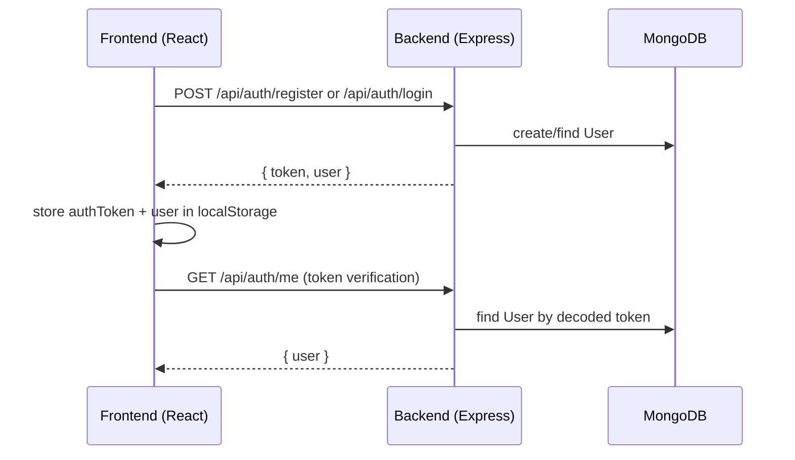

# Auth Flow (Frontend + Backend)

This page explains how login/register and protected routing work end-to-end.

## What the user experiences

- User registers or logs in.
- The app stores a token and uses it for future API calls.
- If a user visits a protected route while logged out, they are redirected to login.

## Sequence (happy path)

## Frontend implementation

### Where the token is stored

- Token key: `authToken` in localStorage
- User cache: `user` in localStorage

See [src/contexts/AuthContext.jsx](../../src/contexts/AuthContext.jsx).

### Where the token is attached to requests

- Axios request interceptor sets `Authorization: Bearer <token>`
- Response interceptor handles `401` by clearing auth and redirecting to login

See [src/services/api.js](../../src/services/api.js).

### Route guards

- `ProtectedRoute` checks `isAuthenticated` and `allowedRoles` and redirects accordingly.

See [src/App.jsx](../../src/App.jsx).

## Backend implementation

### Token verification

- The `protect` middleware extracts the bearer token, verifies it, and attaches `req.user`.

See [backend/middleware/auth.js](../../backend/middleware/auth.js).

### Role-based access

- `authorize('realtor')` etc blocks access when the user role isn’t allowed.

See [backend/middleware/auth.js](../../backend/middleware/auth.js).

## Common failure modes

- **401 loop**: token expired/invalid → axios interceptor forces redirect to login.
- **Role mismatch**: user role doesn’t match route `allowedRoles` in [src/App.jsx](../../src/App.jsx) or backend `authorize()`.
- **Wrong API base URL**: check `VITE_API_BASE_URL`.

## Related docs

- Deployment + CORS expectations: [../../DEPLOYMENT.md](../../DEPLOYMENT.md)
