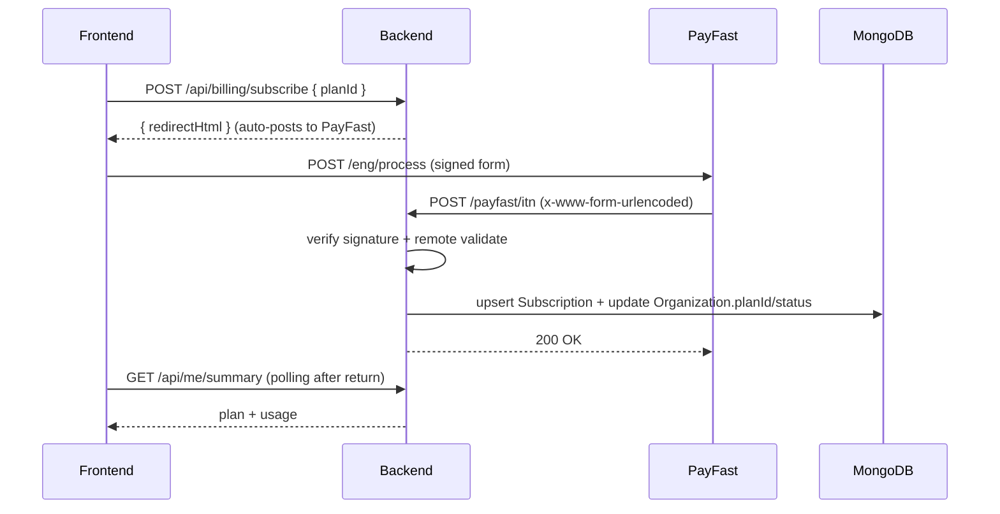

# Billing / PayFast (Subscriptions + ITN)

This codebase integrates PayFast hosted checkout for subscriptions. The backend generates a signed form and PayFast calls back to the backend via ITN (Instant Transaction Notification).

## Concepts you need

- **Checkout/Subscribe**: the user is redirected to PayFast to pay.
- **ITN webhook**: PayFast POSTs a signed form back to the backend with payment status.
- **Server truth**: the backend updates the organization/subscription status from ITN (not from the frontend).

## Sequence (happy path)

## Frontend implementation

### Billing page

- Plan display + purchase actions: [src/pages/BillingPage.jsx](../../src/pages/BillingPage.jsx)
- It calls `POST /billing/subscribe` first, then falls back to `POST /billing/checkout/:planId`.

### Return page polling

- After payment return, the app polls `/me/summary` until the plan is active.

See [src/pages/BillingReturn.jsx](../../src/pages/BillingReturn.jsx).

## Backend implementation

### Why raw body capture exists

PayFast ITN signature validation often requires the exact URL-encoded payload. The server captures the raw body before parsing.

See the raw-body capture middleware in [backend/server.js](../../backend/server.js).

### Billing endpoints

- Primary billing router: [backend/routes/billing.js](../../backend/routes/billing.js)
  - `POST /api/billing/subscribe` (legacy hook used by the frontend)
  - `POST /api/billing/checkout/:planId` (hosted form HTML)
  - `GET /api/billing/subscription` (used by billing UI)

### ITN endpoint

- PayFast ITN route: [backend/routes/payfast.itn.js](../../backend/routes/payfast.itn.js)
  - Signature verification (with fallback variants)
  - Remote validation against PayFast `/eng/query/validate`
  - Merchant checks
  - Updates `Subscription` and `Organization`

## Data model touchpoints

- Organization: [backend/models/Organization.js](../../backend/models/Organization.js)
- Subscription: [backend/models/Subscription.js](../../backend/models/Subscription.js)

## Environment variables (critical)

Backend (Render):

- `MONGO_URI`
- `JWT_SECRET`
- `PAYFAST_MERCHANT_ID`
- `PAYFAST_MERCHANT_KEY`
- `PAYFAST_PASSPHRASE` (optional depending on configuration)
- `PAYFAST_MODE` (`sandbox` vs `live`)
- `APP_BASE_URL` (frontend origin)
- `API_BASE_URL` (backend base incl `/api` in most calls)

Frontend (Vercel):

- `VITE_API_BASE_URL` (ex: `https://nova-prop-backend.onrender.com/api`)

## Known implementation notes (current behavior vs intended)

- There are multiple billing-related endpoints and modes (subscribe vs checkout). Treat [backend/routes/billing.js](../../backend/routes/billing.js) + [backend/routes/payfast.itn.js](../../backend/routes/payfast.itn.js) as the current source of truth.

## Related docs

- Deployment checklist: [../../DEPLOYMENT.md](../../DEPLOYMENT.md)
- PayFast deep dive and signing rules: [../../backend/docs/40-backend-payfast.md](../../backend/docs/40-backend-payfast.md)
- PayFast troubleshooting references: [../../backend/docs/PAYFAST-CONTEXT.MD](../../backend/docs/PAYFAST-CONTEXT.MD)
