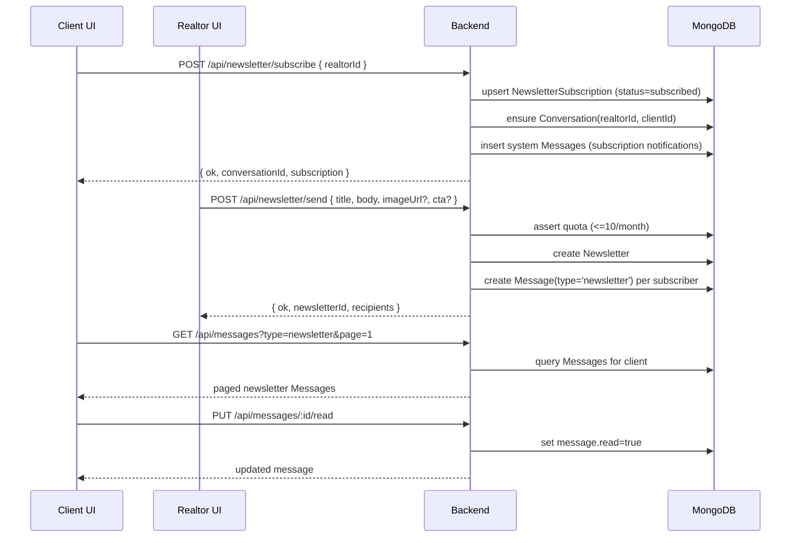

# Newsletters + News Feed

This feature lets:

- **Clients** subscribe to a realtor’s newsletter
- **Realtors** send newsletters to all subscribers (monthly quota)
- **Clients** read newsletters in a feed (`/news`)

Under the hood, newsletters are delivered as `Message` documents with `type: 'newsletter'`.

## Sequence (subscribe → send → read)

## Backend implementation

### Subscription endpoints (client)

- `POST /api/newsletter/subscribe`
- `POST /api/newsletter/unsubscribe`

Implementation: [backend/routes/newsletterRoutes.js](../../backend/routes/newsletterRoutes.js)

### Realtor send endpoints

- `GET /api/newsletter/quota`
- `POST /api/newsletter/send`

Implementation: [backend/routes/newsletterRoutes.js](../../backend/routes/newsletterRoutes.js)

### Feed endpoints

The feed uses the messages API:

- `GET /api/messages?type=newsletter`
- `PUT /api/messages/:id/read`

Routes: [backend/routes/messageRoutes.js](../../backend/routes/messageRoutes.js)

### Data model touchpoints

- Newsletter: [backend/models/Newsletter.js](../../backend/models/Newsletter.js)
- Subscription: [backend/models/NewsletterSubscription.js](../../backend/models/NewsletterSubscription.js)
- Feed delivery: [backend/models/Message.js](../../backend/models/Message.js)
- DM thread: [backend/models/Conversation.js](../../backend/models/Conversation.js)

## Frontend implementation

- Client feed UI: [src/pages/NewsInboxPage.jsx](../../src/pages/NewsInboxPage.jsx)
- Realtor send UI: [src/pages/RealtorNewsletterPage.jsx](../../src/pages/RealtorNewsletterPage.jsx)

The frontend calls the feed endpoints via wrappers in [src/services/api.js](../../src/services/api.js).

## Quotas

- Newsletter monthly send quota is enforced server-side (10/month per realtor).

See quota logic in [backend/routes/newsletterRoutes.js](../../backend/routes/newsletterRoutes.js).

## Related docs

- Implementation notes and API details: [../../NEWSLETTER_SYSTEM_COMPLETE.md](../../NEWSLETTER_SYSTEM_COMPLETE.md)
- Feed UI notes: [../../NEWS_FEED_IMPLEMENTATION.md](../../NEWS_FEED_IMPLEMENTATION.md)
- Backend newsletter update notes: [../../backend/docs/newsletter-update.md](../../backend/docs/newsletter-update.md)
