# AI (Chat + Listing Generator)

This repo includes AI features for realtors:

- **AI chat** (persistent sessions/messages)
- **AI listing generator** (create listing drafts)

The backend calls an LLM provider (Groq) via wrappers in `backend/lib/`.

## AI chat (conceptual flow)

## AI listing generator (conceptual flow)

```mermaid
sequenceDiagram
  participant UI as Frontend
  participant API as Backend
  participant LLM as Groq (LLM)
  participant DB as MongoDB

  UI->>API: POST /api/ai-generator/generate
  API->>API: enforce quota/limits
  API->>LLM: prompt → structured listing text
  LLM-->>API: generated listing
  API->>DB: persist GeneratedListing (history)
  API-->>UI: generated result

  UI->>API: POST /api/properties/save-generated
  API->>DB: create Property from generated data
  API-->>UI: created property
```

## Backend implementation (jump-to files)

- AI chat routes: [backend/routes/aiChatRoutes.js](../../backend/routes/aiChatRoutes.js)
- AI generator routes: [backend/routes/aiGeneratorRoutes.js](../../backend/routes/aiGeneratorRoutes.js)
- Groq controller: [backend/controllers/GroqController.js](../../backend/controllers/GroqController.js)
- Groq client wrapper: [backend/lib/groq.js](../../backend/lib/groq.js)
- Context builder utilities: [backend/lib/aiContextBuilder.js](../../backend/lib/aiContextBuilder.js)

## Frontend implementation

- AI generator UI: [src/pages/AIGeneratorPage.jsx](../../src/pages/AIGeneratorPage.jsx)

## Quotas / limits

AI quotas/limits are enforced server-side. Confirm which middleware is applied on the relevant route:

- AI quota middleware examples: [backend/middleware/enforcePlanQuota.js](../../backend/middleware/enforcePlanQuota.js), [backend/middleware/checkListingLimit.js](../../backend/middleware/checkListingLimit.js)

## Related docs

- AI studio spec notes: [../../instructions/ai.md](../../instructions/ai.md)
