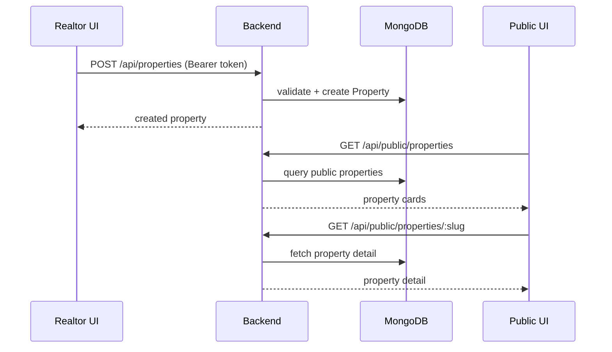

# Properties + Public Browse

There are two “views” of properties:

- **Realtor/private**: realtor manages their inventory
- **Public browse**: anyone can browse and view public property detail pages

## Sequence (create property → public browse)

## Frontend implementation

- Realtor inventory list: [src/pages/PropertiesPage.jsx](../../src/pages/PropertiesPage.jsx)
- Add/edit: [src/pages/AddPropertyPage.jsx](../../src/pages/AddPropertyPage.jsx), [src/pages/EditPropertyPage.jsx](../../src/pages/EditPropertyPage.jsx)
- Public browse: [src/pages/PublicPropertiesPage.jsx](../../src/pages/PublicPropertiesPage.jsx)
- Public detail: [src/pages/PublicPropertyDetailsPage.jsx](../../src/pages/PublicPropertyDetailsPage.jsx)

## Backend implementation

- Private property routes: [backend/routes/propertyRoutes.js](../../backend/routes/propertyRoutes.js)
- Public browse routes: [backend/routes/publicBrowseRoutes.js](../../backend/routes/publicBrowseRoutes.js)
- Property controller: [backend/controllers/propertyController.js](../../backend/controllers/propertyController.js)
- Property model: [backend/models/Property.js](../../backend/models/Property.js)

## Quotas / plan limits

Property limits are enforced via middleware. The exact middleware used may differ by route.

- Example middleware: [backend/middleware/checkPropertyLimit.js](../../backend/middleware/checkPropertyLimit.js)

## Related docs

- Public “view details” UX notes: [../../VIEW_DETAILS_FEATURE.md](../../VIEW_DETAILS_FEATURE.md)
