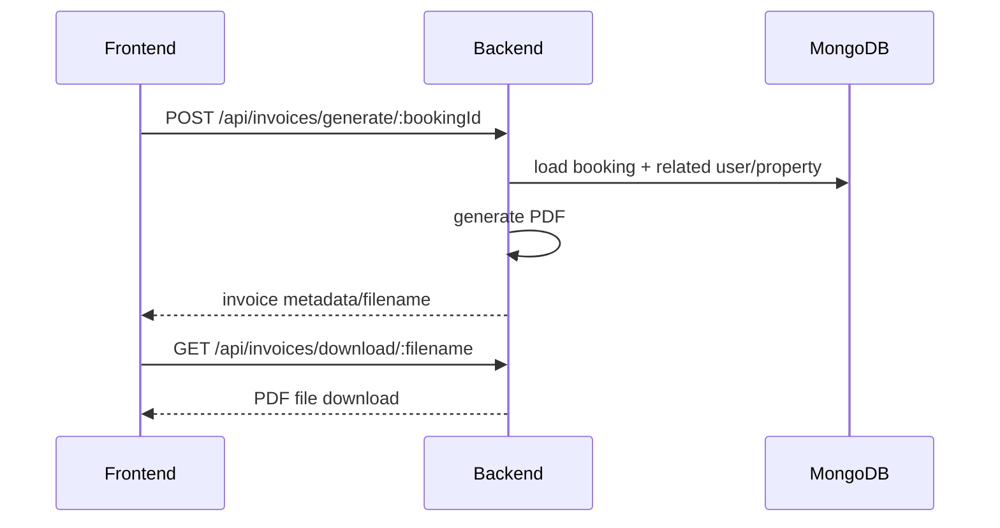

# Uploads + Invoices

This repo includes:

- Static file hosting for uploaded assets (`/uploads`)
- Invoice PDF generation and download

## Upload serving (backend)

The backend serves uploaded files as static assets:

- Express static mount: `/uploads` in [backend/server.js](../../backend/server.js)
- Physical folder: [backend/uploads/](../../backend/uploads/) (runtime; may not be committed)

## Invoice generation (conceptual flow)

## Frontend implementation

- Invoice calls are wrapped in [src/services/api.js](../../src/services/api.js).

## Backend implementation

- Invoice routes: [backend/routes/invoiceRoutes.js](../../backend/routes/invoiceRoutes.js)
- Invoice controller: [backend/controllers/invoiceController.js](../../backend/controllers/invoiceController.js)

## Related docs

- Deployment: [../../DEPLOYMENT.md](../../DEPLOYMENT.md)
